# Página Web Responsive

Proyecto de página web responsive para la asignatura de Lenguaje de Marcas.

Primer Curso de DAW Presencial 23/24

Autores: Francesc Barbón Cursach y Francesc Sorà Quevedo

## Estructura del repositorio

El Repositorio tiene la siguiente estructura:

__Pagina web__   
&nbsp; &nbsp;     |  
&nbsp; &nbsp;     |-----__Contents__  
&nbsp; &nbsp;     |&nbsp; &nbsp; &nbsp; &nbsp; &nbsp; &nbsp;         |  
&nbsp; &nbsp;     |&nbsp; &nbsp; &nbsp; &nbsp; &nbsp; &nbsp;         |------__Imagenes__  
&nbsp; &nbsp;     |  
&nbsp; &nbsp;     |-----__Camiseta.html__  
&nbsp; &nbsp;     |-----__Index.html__  
&nbsp; &nbsp;     |-----__Jugadores.html__  
&nbsp; &nbsp;     |-----__Sobre_nosotros.html__  
&nbsp; &nbsp;     |-----__css.css__  
&nbsp; &nbsp;     |-----__README.md__  

## Tecnologies utilitzades

para la realización de este proyecto se han utilizado las siguientes tecnologías:
1. __HTML5__: Html significa HyperText Markup Language y es un estandar que sirve para definir la estructura, el diseño y el contenido de una página web regulado por W3C. En concreto, HTML5 es la quinta revisión del lenguaje que incorpora mejoras de calidad de vida y legibilidad como son las etiquetas semánticas. La versión definitiva fue lanzada en Octubre de 2014. Uno de los problemas de esta versión fueron las nuevas etiquetas que los navegadores antiguos no reconocian, habiendo de actualizar-los para soportar-la.
2. __CSS3__: CSS son las siglas para Cascade Style Sheet. Se trata de un lenguaje de diseño gráfico que utilizamos para dar estilos a las páginas escritas de forma estructurada con un lenguaje de marcado, en nuestro caso HTML. Funciona a bas ede aplica _reglas_ a los elementos del archivo HTML. Estas reglas se estructuran de arriba a abajo, es decir, se tiene que ir con cuidado a no definir reglas superpuestas. 
3. __VSCODE__: Visual Studio Code es un editor de codigo fuente personalizable desarrollado por Microsoft. Es compatible con varios lenguajes de programación, por cual cosa es la plataforma que hemos utilizado para realizar nuestro proyecto.
4. __GitHub__: Se trata de una plataforma de desarrollo colaborativo basado en el sistema de control de versions _Git_. Se basa en la creación de repositorios para la gestión de proyectos. Para controlar la integridad del codigo se pueden crear ramas (branch) las cuales son "copias" de la original pero que pueden ser modificadas de forma independiente y una vez realiado el trabajo y testeado el codigo se pueden fusionar con la rama original para añadir los cambios de forma segura.

## Características de la web

La web está basada en una página de un equipo de e-Sports (deportes electrónicos).  
Consta de 4 páginas:  
- Una pagina inicial des de la cual se pueden ver las últimas noticias del equipo  
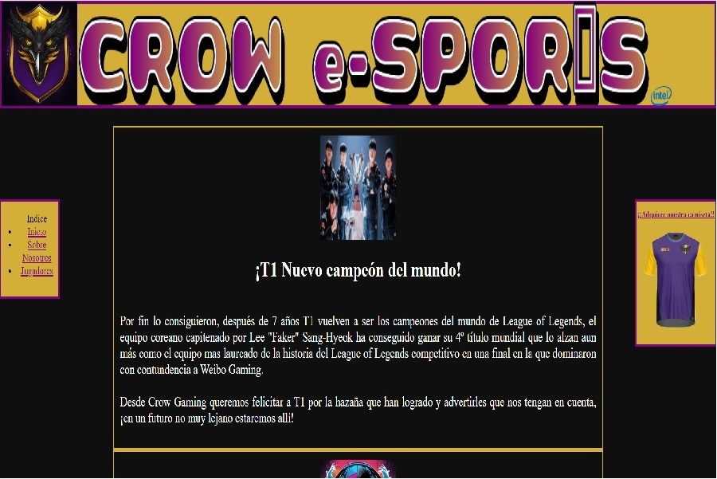  

Como se puede ver en la imagen anterior a la izquierda se encuentra un menú de navegación desde el cual podemos acceder al resto de páginas de la web. De formar alternativa clicando sobre el logo del equipo que se encuentro en el encabezamiento podemos volver a la página inicial. A la derecha se ve el logo de una camiseta, si clicamos sobre el nos aparecera la página siguiente:   
  
- Página de venta de camisetas  
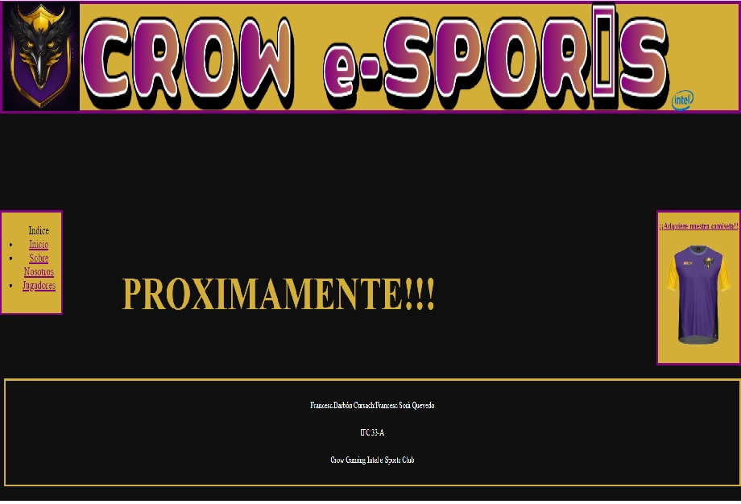 
   
Podemos observar en las capturas como tanto la cabecera, el pie de página, el menú de navegación y la camiseta son elementos fijos a la página, es decir, que aunque hagamos scroll estos elementos nunca desapareceran de la pantalla y siempre estaria disponibles para el usuario. Se podria decir que estos elementos componen el esqueleto de lo que es la página, ya que son comunes a toda ella. Otra característica del encabezamiento es que tiene un valor de prioridad z sobre el resto de elementos, por cual cosa cuando hacemos scroll los elementos del cuerpo de la página quedan por debajo y nunca la tapan, haciendo de esta mánera énfasis en que se trata de la estructura sobre la cual se encuadra y se sustentan el resto de contenidos. 
  
- Página d'información (Sobre Nosotros)  
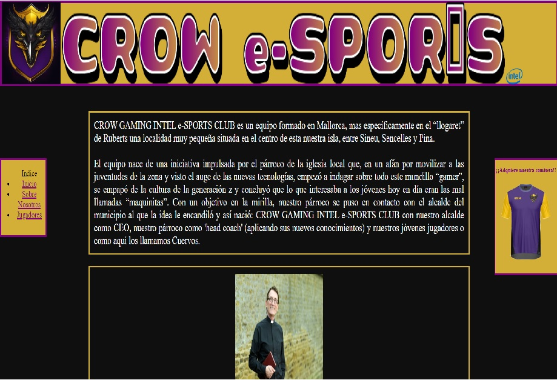  
  
Esta página contiene información sobre el equipo directivo y organizativo, así como contexto sobre la creación del equipo.

- Página de jugadores del equipo  
  
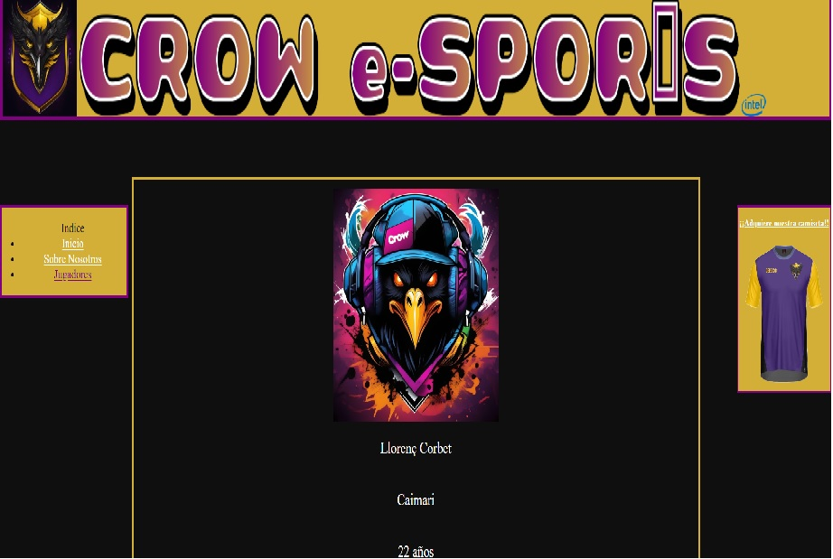  

Para acabar, la última página contiene información sobre los jugadores del equipo  
  
## Evolución del proyecto  

1. __Versión 1.0__: Inicialmente nos centramos en crear un fondo que fuese común para toda la web, por esto decidimos un patrón de colores que se repetiria durante todo el proyecto para darle cohesión. El siguiente fue diseñar la estructura y pensar donde irían colocados los elementos de la página, por eso optamos por un esqueleto tipo encuadrado donde tanto la cabecera como los menus (a los lados) fuesen siempre visibles y lo que se fuera moviendo fuera el contenido principal de la página. Una vez decidido también el logo fuimos probando tamaños hasta que dimos con la siguiente estructura

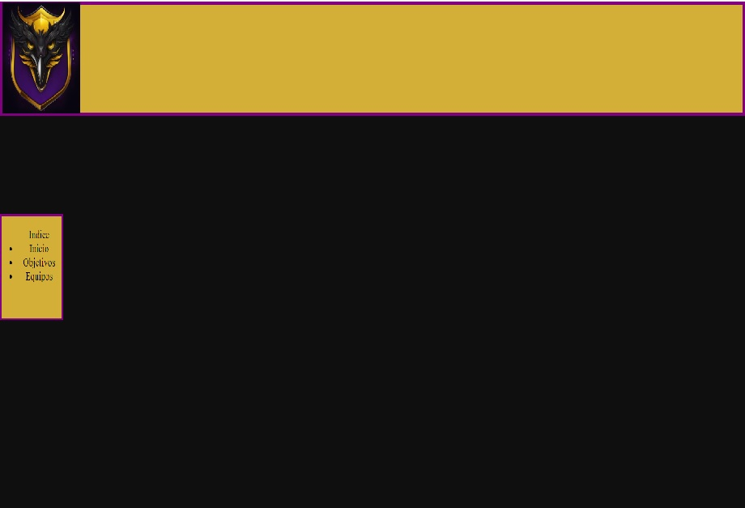  
  
2. __Versión 2.0__: El siguiente paso fue la creación del resto de las páginas que conformarían la web, así como poner en funcionamiento el menú para navegar entre ellas  
  
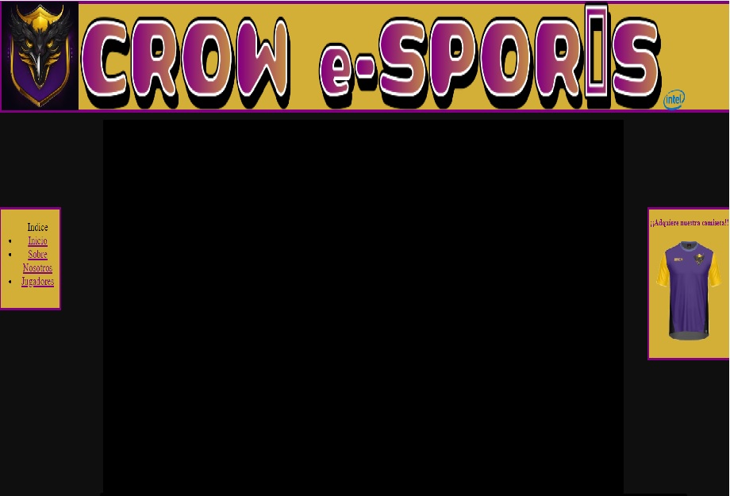  
  
3. __Versión 3.0__: En esta versión implementamos dos media queries fijas para dos anchuras de pantalla diferentes sin utilizar flexbox i rellenamos el contenido de las diferentes pàginas.
  
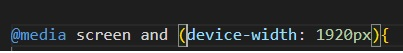  
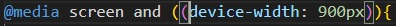 
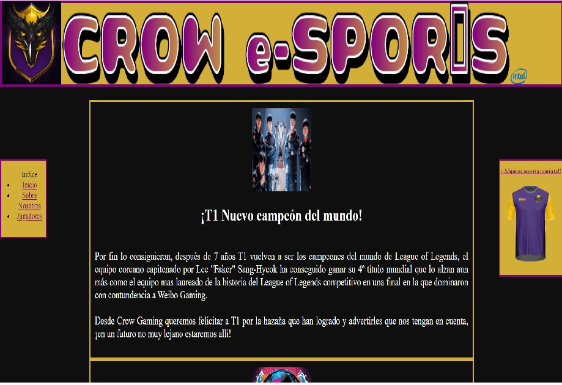 
  
4. __Versión 4.0__: Esta es la versión final pasando todo el contenido a flex y añadiendo media queries para otras dos resoluciones  
  
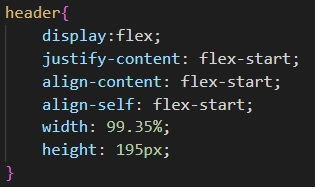  
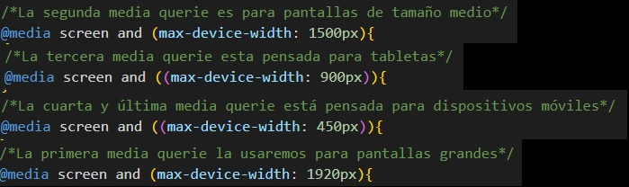  
  

## Repartición de tareas  
  
El trabajo realizado por cada uno se ve reflejado en esta tabla de excel que tambien añadiremos al repositiorio  
  
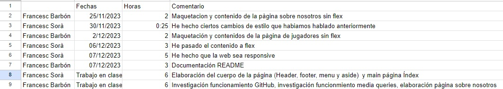  

  

